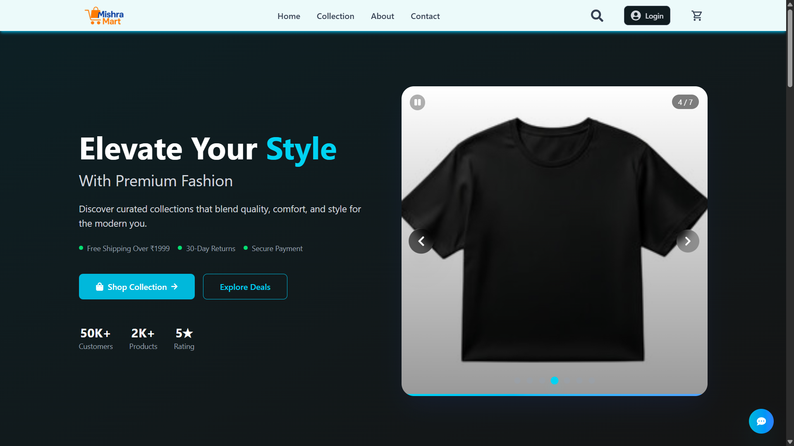
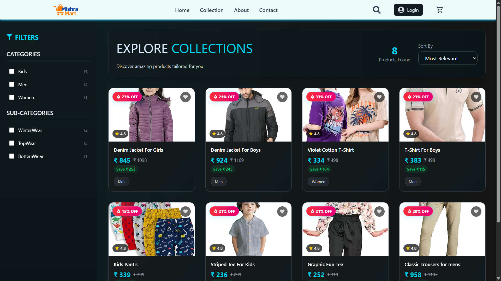
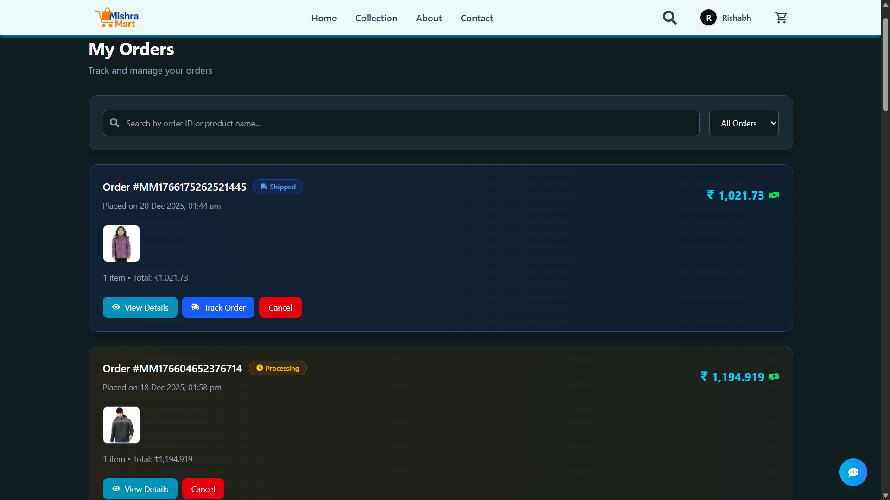
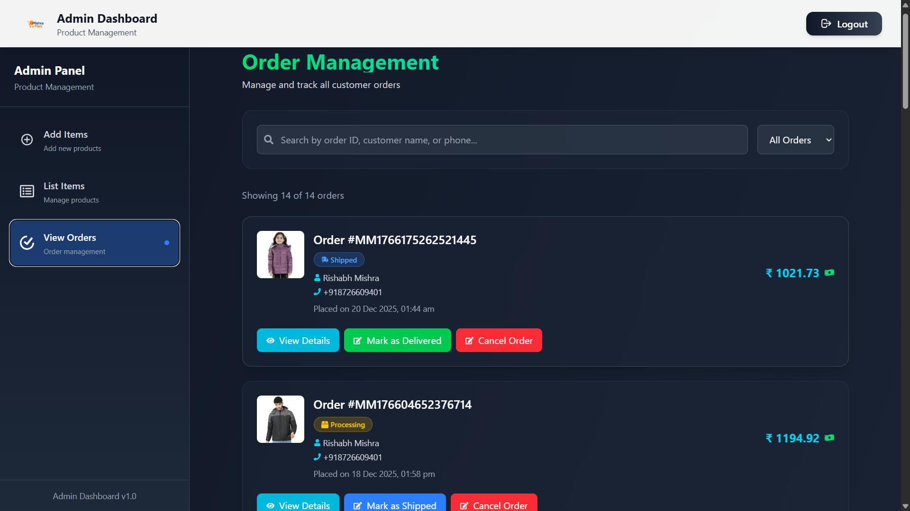
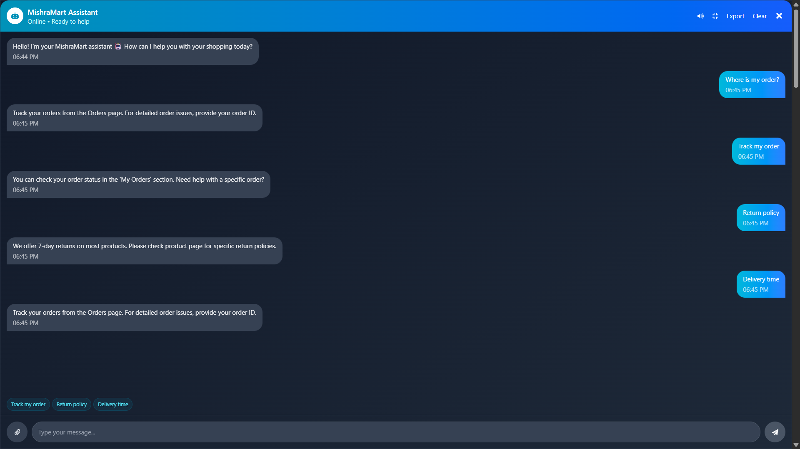

# 🛒 MishraMart – Full Stack Ecommerce Web Application (MERN)


MishraMart is a **real-world full stack Ecommerce Web Application** built using the  
**MERN Stack (MongoDB, Express.js, React.js, Node.js)**.

This platform allows users to **shop clothes online**, manage **wishlist and orders**, interact with an **integrated chatbot**, and provides a **powerful Admin Panel** for managing products, users, and orders — similar to real ecommerce platforms.

---

## 📌 Table of Contents
- Features
- Tech Stack
- Screenshots
- Project Structure
- Image Upload Flow
- Authentication & Security
- How to Run Locally
- Learning Outcomes
- Future Scope

---

## 🚀 Features

### 👤 User Features
- User Registration & Login (JWT Authentication)
- Browse clothing products
- Product details and search
- Add to Cart
- ❤️ Wishlist (save products for later)
- 📦 Place Orders & View Order History
- User profile management
- 🤖 Integrated Chatbot for assistance
- Fully responsive UI (Mobile + Desktop)

### ❤️ Wishlist & Orders
- Wishlist system like real ecommerce websites
- Add / remove products from wishlist
- Wishlist data stored in MongoDB
- Order creation and order history
- Separate order section for users

### 🤖 Chatbot
- Chatbot integrated for user interaction
- Helps users with navigation and queries
- Implemented using backend routes and frontend chatbot components

---

## 🛠️ Admin Panel Features
- Secure Admin Authentication
- Add / Update / Delete Products
- Upload product images
- Manage Orders
- View Users
- Inventory control
- Real-time notifications

---

## 🧑‍💻 Tech Stack

### Frontend
- React.js (Vite)
- HTML, CSS, JavaScript
- React Router DOM
- Context API
- Axios

### Backend
- Node.js
- Express.js
- JWT Authentication
- bcrypt.js

### Database
- MongoDB
- Mongoose

### Image Upload & Storage
- Multer (file upload handling)
- Cloudinary (cloud image storage)

### Tools & Deployment
- Git & GitHub
- Render (Backend)
- Netlify / Vercel (Frontend & Admin Panel)
- MongoDB Atlas

---

## 📸 Screenshots






```

---

## 📂 Project Structure

```
MishraMart/
│
├── Admin Panel/
│   ├── src/
│   │   ├── components/
│   │   ├── context/
│   │   ├── Pages/
│   │   ├── App.jsx
│   │   └── main.jsx
│   ├── index.html
│   └── package.json
│
├── backend/
│   ├── config/
│   │   ├── cloudinary.js
│   │   ├── db.js
│   │   └── token.js
│   ├── controller/
│   │   ├── authController.js
│   │   ├── productController.js
│   │   ├── orderController.js
│   │   ├── chatbotController.js
│   │   └── userController.js
│   ├── middleware/
│   │   ├── authMiddleware.js
│   │   ├── adminAuth.js
│   │   └── multer.js
│   ├── model/
│   │   ├── UserModel.js
│   │   ├── ProductModel.js
│   │   ├── OrderModel.js
│   │   ├── WishlistModel.js
│   │   └── Cart.js
│   ├── routes/
│   │   ├── authRoutes.js
│   │   ├── productRoutes.js
│   │   ├── orderRoutes.js
│   │   ├── wishlistRoutes.js
│   │   └── chatbotRoutes.js
│   ├── index.js
│   └── package.json
│
├── Frontend/
│   ├── src/
│   │   ├── components/
│   │   ├── context/
│   │   ├── pages/
│   │   ├── utils/
│   │   ├── App.jsx
│   │   └── main.jsx
│   ├── index.html
│   └── package.json
│
└── README.md
```

---

## 🖼️ Image Upload Flow (Multer + Cloudinary)

1. Admin uploads product image
2. Multer handles incoming file
3. Image is uploaded to Cloudinary
4. Cloudinary returns a secure image URL
5. Image URL is stored in MongoDB
6. Image displayed on frontend

✔ No local image storage  
✔ Secure & scalable  
✔ Fast CDN delivery  

---

## 🔐 Authentication & Security
- JWT-based authentication
- Password hashing using bcrypt
- Protected routes
- Role-based access (Admin / User)
- Secure REST APIs

---

## ⚙️ How to Run Locally

### Backend
```bash
cd backend
npm install
npm start
```

### Frontend
```bash
cd Frontend
npm install
npm run dev
```

### Admin Panel
```bash
cd "Admin Panel"
npm install
npm run dev
```

---

## 📚 Learning Outcomes
- Complete MERN stack development
- Wishlist & order system like real ecommerce apps
- Chatbot integration
- Admin panel implementation
- Multer & Cloudinary image handling
- Authentication & deployment experience

---

## 🔮 Future Scope
- Online payment gateway
- Order tracking system
- Product reviews & ratings
- AI-powered chatbot improvements
- React Native mobile application

---

## 👨‍💻 Developer
**Rishabh Mishra**  
MERN Stack & React Native Developer  

⭐ If you like this project, don’t forget to star the repository!
